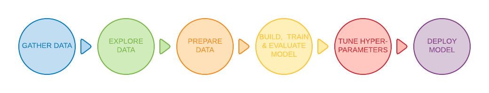

## 介绍
文本分类算法是大规模处理文本数据的各种软件系统的核心。 电子邮件软件使用文本分类来确定传入邮件是发送到收件箱还是过滤到垃圾邮件文件夹中。 讨论论坛使用文本分类来确定是否应将评论标记为不合适。

这是**主题分类**的两个示例，将文本文档分类为预定义的一组主题。 在许多主题分类问题中，此分类主要基于文本中的关键字。


图 1: 主题分类用于标记传入的垃圾邮件，这些邮件被过滤到垃圾邮件文件夹中。

另一种常见的文本分类类型是**情感分析**，其目标是识别文本内容的极性：文本表达的意见类型。 这可以采取二进制喜欢/不喜欢评级的形式，或更精细的选项集，例如1到5的星级评级。情绪分析的示例包括分析Twitter帖子以确定人们是否喜欢黑豹电影，或者从沃尔玛评论中推断出公众对耐克新品牌鞋的看法。

本指南将教您一些解决文本分类问题的关键机器学习最佳实践。这是你将学到的东西：
+ 使用机器学习解决文本分类问题的高级的、端到端的工作流程
+ 如何为文本分类问题选择正确的模型
+ 如何使用TensorFlow实现您的选择模型

### 文本分类工作流程
以下是用于解决机器学习问题的工作流程的高度概述：
+ Step 1: Gather Data
+ Step 2: Explore Your Data
+ Step 2.5: Choose a Model*
+ Step 3: Prepare Your Data
+ Step 4: Build, Train, and Evaluate Your Model
+ Step 5: Tune Hyperparameters
+ Step 6: Deploy Your Model


图2：解决机器学习问题的工作流程

> “选择模型”不是传统机器学习工作流程的正式步骤;但是，为您的问题选择合适的模型是一项关键任务，可以明确并简化后续步骤中的工作。

以下部分详细介绍了每个步骤，以及如何为文本数据实现它们。

## 第1步：收集数据
**收集数据是解决任何监督机器学习问题的最重要步骤，您的文本分类器只能与构建它的数据集一样好**。

如果您没有想要解决的特定问题并且只对一般的文本分类感兴趣，那么可以使用大量开源数据集。 您可以在我们的[GitHub仓库](https://github.com/google/eng-edu/blob/master/ml/guides/text_classification/load_data.py)中找到其中一些链接。 另一方面，如果您正在解决特定问题，则需要收集必要的数据。 许多组织提供用于访问其数据的公共API。例如，Twitter API或NY Times API。 您可以利用这些来解决您要解决的问题。

以下是收集数据时需要记住的一些重要事项：
+ 如果您使用的是公共API，请在使用之前了解API的限制。 例如，某些API会对您进行查询的速率设置限制。
+ 你拥有的训练样例（在本指南的其余部分称为样本）越多越好。 这将有助于您的模型更好地概括。
+ 确保每个类或主题的样本数量不会过度失衡。 也就是说，每个类中应该有相当数量的样本。
+ 确保您的样品充分覆盖可能的输入空间，而不仅仅是常见情况。

在本指南中，我们将使用[Internet电影数据库（IMDb）电影评论数据集](http://ai.stanford.edu/~amaas/data/sentiment/)来说明工作流程。 该数据集包含人们在IMDb网站上发布的电影评论，以及指示评论者是否喜欢该电影的相应标签（“正面”或“否定”）。 这是情绪分析问题的典型例子。

## 第2步：探索您的数据
构建和训练模型只是工作流程的一部分。事先了解数据的特征将使您能够构建更好的模型。这可能只是意味着获得更高的准确性。它还可能意味着需要更少的数据用于训练或更少的计算资源。
### 加载数据
首先，让我们将数据集加载到Python中。

```python
def load_imdb_sentiment_analysis_dataset(data_path, seed=123):
    """Loads the IMDb movie reviews sentiment analysis dataset.

    # Arguments
        data_path: string, path to the data directory.
        seed: int, seed for randomizer.

    # Returns
        A tuple of training and validation data.
        Number of training samples: 25000
        Number of test samples: 25000
        Number of categories: 2 (0 - negative, 1 - positive)

    # References
        Mass et al., http://www.aclweb.org/anthology/P11-1015

        Download and uncompress archive from:
        http://ai.stanford.edu/~amaas/data/sentiment/aclImdb_v1.tar.gz
    """
    imdb_data_path = os.path.join(data_path, 'aclImdb')

    # Load the training data
    train_texts = []
    train_labels = []
    for category in ['pos', 'neg']:
        train_path = os.path.join(imdb_data_path, 'train', category)
        for fname in sorted(os.listdir(train_path)):
            if fname.endswith('.txt'):
                with open(os.path.join(train_path, fname)) as f:
                    train_texts.append(f.read())
                train_labels.append(0 if category == 'neg' else 1)

    # Load the validation data.
    test_texts = []
    test_labels = []
    for category in ['pos', 'neg']:
        test_path = os.path.join(imdb_data_path, 'test', category)
        for fname in sorted(os.listdir(test_path)):
            if fname.endswith('.txt'):
                with open(os.path.join(test_path, fname)) as f:
                    test_texts.append(f.read())
                test_labels.append(0 if category == 'neg' else 1)

    # Shuffle the training data and labels.
    random.seed(seed)
    random.shuffle(train_texts)
    random.seed(seed)
    random.shuffle(train_labels)

    return ((train_texts, np.array(train_labels)),
            (test_texts, np.array(test_labels)))
```

### 检查数据
加载数据后，最好对其进行一些检查：选择一些样本并手动检查它们是否符合您的预期。 例如，打印一些随机样本以查看情绪标签是否与评论的情绪相对应。以下是我们从IMDb数据集中随机选取的评论：“Ten minutes worth of story stretched out into the better part of two hours. When nothing of any significance had happened at the halfway point I should have left.”预期的情绪（负面）与样本的标签相匹配。

### 收集关键指标
验证数据后，请收集以下有助于表征文本分类问题的重要指标：

1. 样本数（Number of samples）：数据中的示例总数。
2. 类别数量（Number of classes）：数据中的主题或类别总数。
3. 每个类的样本数（Number of samples per class）：每个类的样本数（主题/类别）。 在平衡数据集中，所有类都将具有相似数量的样本; 在不平衡的数据集中，每个类中的样本数量会有很大差异。
4. 每个样本的单词数（Number of words per sample）：样本中单词数量的中位数。
5. 单词的频率分布（Frequency distribution of words）：显示数据集中每个单词的频率（出现次数）的分布。
6. 样本长度分布（Distribution of sample length）：分布显示数据集中每个样本的单词数。

让我们看看这些指标的值对于IMDb评论数据集是什么（有关字频和样本长度分布的图，请参见图3和图4）。

|Metric name	Metric| value|
|-|-|
|Number of samples	|25000|
|Number of classes	|2|
|Number of samples per class	|12500|
|Number of words per sample	|174|
表1：IMDb审查数据集指标

[explore_data.py](https://github.com/google/eng-edu/blob/master/ml/guides/text_classification/explore_data.py)包含用于计算和分析这些指标的函数。以下是几个例子：

```python
import numpy as np
import matplotlib.pyplot as plt

def get_num_words_per_sample(sample_texts):
    """Returns the median number of words per sample given corpus.

    # Arguments
        sample_texts: list, sample texts.

    # Returns
        int, median number of words per sample.
    """
    num_words = [len(s.split()) for s in sample_texts]
    return np.median(num_words)

def plot_sample_length_distribution(sample_texts):
    """Plots the sample length distribution.

    # Arguments
        samples_texts: list, sample texts.
    """
    plt.hist([len(s) for s in sample_texts], 50)
    plt.xlabel('Length of a sample')
    plt.ylabel('Number of samples')
    plt.title('Sample length distribution')
    plt.show()
```


图3：IMDb的词的频率分布


图4：IMDb的样本长度分布

## 步骤2.5：选择一个模型
此时，我们已经汇总了数据集，并深入了解了数据的关键特征。接下来，根据我们在第2步中收集的指标，我们应该考虑应该使用哪种分类模型。这意味着/提出问题，例如“我们如何将文本数据呈现给期望数字输入的算法？”（这称为数据预处理和矢量化），“我们应该使用什么类型的模型？”，“什么配置参数我们应该使用我们的模型吗？”等。

经过数十年的研究，我们可以访问大量的数据预处理和模型配置选项。然而，可供选择的大量可行选项的可用性极大地增加了手头的特定问题的复杂性和范围。鉴于最佳选择可能并不明显，一个天真的解决方案是尽力尝试每一种可能的选择，通过直觉修剪一些选择。然而，这将是非常昂贵的。

在本指南中，我们尝试显着简化选择文本分类模型的过程。对于给定的数据集，我们的目标是找到实现接近最大精度的算法，同时最小化训练所需的计算时间。我们针对不同类型的问题（特别是情感分析和主题分类问题）运行了大量（~450K）实验，使用12个数据集，交替用于不同数据预处理技术和不同模型体系结构之间的每个数据集。这有助于我们识别影响最佳选择的数据集参数。

下面的模型选择算法和流程图是我们实验的总结。如果您还不理解其中使用的所有术语，请不要担心，本指南的以下部分将对其进行深入解释。

### 数据准备与模型构建算法
1. 计算样本数量/每个样本的单词数的比率（the number of samples/number of words per sample）。
2. 如果此比率小于1500，则将文本标记为n-gram并使用简单的多层感知器（MLP）模型对它们进行分类（下面的流程图中的左分支）：
  a. 将样本分成单词n-gram，将n-gram转换为向量。
  b. 评分向量的重要性，然后使用分数选择前20K。
  c. 建立MLP模型。
3. 如果比率大于1500，则将文本标记为序列并使用sepCNN模型对它们进行分类（下面的流程图中的右分支）：
  a. 将样本分成单词，根据频率选择前20K词。
  b. 将样本转换为单词序列向量。
  c. 如果原始样本数/每个样本比率的单词数小于15K，则使用sepCNN模型的微调预训练嵌入可能会提供最佳结果。
4. 使用不同的超参数值测量模型性能，以找到数据集的最佳模型配置。


图5：文本分类流程图

此流程图回答了两个关键问题：
1. 我们应该使用哪种学习算法或模型？
2. 我们应该如何准备数据以有效地学习文本和标签之间的关系？

第二个问题的答案取决于第一个问题的答案，我们预先处理数据的方式将取决于我们选择的模型。 模型可以大致分为两类：使用单词排序信息的那些（序列模型），以及仅将文本视为“bags”（sets）单词（n-gram模型）的模型。 序列模型的类型包括卷积神经网络（CNN），递归神经网络（RNN）及其变体。 n-gram模型的类型包括逻辑回归，简单的多层感知器（MLP或完全连接的神经网络），梯度增强树和支持向量机。

**从我们的实验中，我们观察到“样本数”（S）与“每个样本的单词数”（W）的比率与哪个模型表现良好相关**。

当该比率的值很小（<1500）时，以n-gram为输入的小型多层感知器（我们称之为选项A）表现得更好或至少与序列模型一样好。 MLP很容易定义和理解，并且它们比序列模型花费更少的计算时间。 当此比率的值很大（> = 1500）时，使用序列模型（选项B）。 在接下来的步骤中，您可以根据样本/单词样本比率跳过所选模型类型的相关小节（标记为A或B）。

在我们的IMDb审查数据集的情况下，样本/每个样本的单词比率是~144。 这意味着我们将创建一个MLP模型。

**使用上述流程图时，请注意，由于以下几个原因，它可能不一定会使您获得问题的最佳结果**：
- 你的目标可能不同。 我们针对可在尽可能短的计算时间内实现的最佳准确率（accuracy）进行了优化。 替代流程可以产生更好的结果，例如，在优化曲线下面积（AUC）时。
- 我们选择了典型和常见的算法选择。 随着该领域的不断发展，新的前言算法和增强功能可能与您的数据相关，并且可能表现更好。
- 虽然我们使用多个数据集来推导和验证流程图，但您的数据集可能有一些特定的特征，这些特征有利于使用备用流程。

## 第3步：准备数据
在将数据提供给模型之前，需要将其转换为模型可以理解的格式。

首先，我们收集的数据样本可能是特定的顺序。 我们不希望任何与样本排序相关的信息影响文本和标签之间的关系。 例如，如果数据集按类排序，然后分成训练/验证集，则这些集将不能代表整体数据分布。

确保模型不受数据顺序影响的简单最佳实践是在执行任何其他操作之前始终对数据进行混洗。 如果您的数据已经拆分为训练和验证集，请确保转换验证数据的方式与转换训练数据的方式相同。 如果您还没有单独的训练和验证集，您可以在洗牌后拆分样本; 通常使用80％的样本进行训练，20％进行验证。

其次，机器学习算法将数字作为输入。 这意味着我们需要将文本转换为数字向量。 此过程有两个步骤：
1. 标记化（Tokenization，广义上的“分词”）：将文本分为单词或较小的子文本，这样可以很好地概括文本和标签之间的关系。 这决定了数据集的“词汇表”，一组唯一的令牌集（unique tokens，令牌集就是储存令牌token和数字之间映射的字典。
2. 矢量化：定义一个很好的数值度量来表征这些文本。

让我们看看如何对n-gram向量和序列向量执行这两个步骤，以及如何使用特征选择和归一化技术优化向量表示。

### N-gram向量[选项A]
在随后的段落中，我们将看到如何对n-gram模型进行标记化和矢量化。我们还将介绍如何使用特征选择和规范化技术优化n-gram表示。

在n-gram向量中，文本被表示为唯一n-gram的集合：n个相邻令牌的组（通常是单词）。 考虑一下文本“The mouse ran up the clock”。 在这里，单词unigrams（n = 1）是 ['the'，'mouse'，'ran'，'up'，'clock']，bigrams这个词（n = 2）是 ['the mouse', 'mouse ran', 'ran up', 'up the', 'the clock']，等等。

#### 标记化 Tokenization
我们发现，将单词unigrams + bigrams标记为提供良好的准确性，同时减少计算时间。

#### 矢量化 Vectorization
一旦我们将文本样本分成n-gram，我们需要将这些n-gram转换为我们的机器学习模型可以处理的数值向量。下面的示例显示了为两个文本生成的unigrams和bigrams分配的索引。

```
Texts: 'The mouse ran up the clock' and 'The mouse ran down'
Index assigned for every token: {'the': 7, 'mouse': 2, 'ran': 4, 'up': 10,
  'clock': 0, 'the mouse': 9, 'mouse ran': 3, 'ran up': 6, 'up the': 11, 'the
clock': 8, 'down': 1, 'ran down': 5}
```

将索引（indexes）分配给n-gram后，我们通常使用以下选项之一进行矢量化。

|矢量化方法名称|说明|例子|
|-|-|-|
|**One-hot encoding**|每个示例文本都表示为一个向量，表示文本中是否存在令牌（token）。|'The mouse ran up the clock' = [1, 0, 1, 1, 1, 0, 1, 1, 1, 1, 1, 1]|
|**Count encoding**|每个示例文本都表示为一个向量，指示文本中令牌的计数。请注意，对应于unigrams (n = 1) ，'the'对应的元素现在表示为2，因为单词“the”在文本中出现两次。|'The mouse ran up the clock' = [1, 0, 1, 1, 1, 0, 1, 2, 1, 1, 1, 1]|
|**tf-idf encoding**|上述两种方法的问题在于，在所有文档中以相似频率出现的常用词（即，对数据集中的文本样本不是特别独特的词）不会受到惩罚。 例如，像“a”这样的单词将在所有文本中频繁出现。 因此，对于“the”而言，比其他更有意义的单词更高的令牌数量并不是非常有用。|'The mouse ran up the clock' = [0.33, 0, 0.23, 0.23, 0.23, 0, 0.33, 0.47, 0.33, 0.23, 0.33, 0.33] (See Scikit-learn TdidfTransformer)|

还有许多其他矢量表示，但以上三种是最常用的。

我们观察到tf-idf编码在准确性方面略优于其他两个（平均：高出0.25-15％），并建议使用此方法对n-gram进行矢量化。 但是，请记住它占用更多内存（因为它使用浮点表示）并且需要更多时间来计算，特别是对于大型数据集（在某些情况下可能需要两倍的时间）。

#### 特征选择 Feature selection
当我们将数据集中的所有文本转换为单词uni + bigram标记时，我们最终可能会有数万个标记。 并非所有这些令牌/特征都有助于标签预测。 因此我们可以删除某些令牌，例如在数据集中极少发生的令牌。 我们还可以度量特征重要性（每个标记对标签预测的贡献程度），并且仅包括信息量最大的标记。

有许多统计函数可以获取特征和相应的标签并输出特征重要性分数。 两个常用的函数是f_classif和chi2。 我们的实验表明，这两个功能同样表现良好。

更重要的是，我们发现许多数据集的精度达到了大约20,000个特征（见图6）。 在此阈值上添加更多特征的贡献非常小，有时甚至会导致过度拟合并降低性能。


图6：Top K 特征与准确率。在整个数据集中，精确度达到20K左右的特征。

#### 标准化 Normalization
标准化将所有要素/样本值转换为小值和类似值。 这简化了学习算法中的梯度下降收敛。 从我们所看到的情况来看，数据预处理期间的规范化似乎并没有在文本分类问题中增加太多价值，我们建议您跳过此步骤。

以下代码汇总了上述所有步骤：
+ 将文本样本标记为单词uni + bigrams，
+ 使用tf-idf编码进行矢量化，
+ 通过丢弃出现少于2次的标记并使用f_classif计算特征重要性，仅从标记向量中选择前20,000个特征。

```python
from sklearn.feature_extraction.text import TfidfVectorizer
from sklearn.feature_selection import SelectKBest
from sklearn.feature_selection import f_classif

# Vectorization parameters
# Range (inclusive) of n-gram sizes for tokenizing text.
NGRAM_RANGE = (1, 2)

# Limit on the number of features. We use the top 20K features.
TOP_K = 20000

# Whether text should be split into word or character n-grams.
# One of 'word', 'char'.
TOKEN_MODE = 'word'

# Minimum document/corpus frequency below which a token will be discarded.
MIN_DOCUMENT_FREQUENCY = 2

def ngram_vectorize(train_texts, train_labels, val_texts):
    """Vectorizes texts as n-gram vectors.

    1 text = 1 tf-idf vector the length of vocabulary of unigrams + bigrams.

    # Arguments
        train_texts: list, training text strings.
        train_labels: np.ndarray, training labels.
        val_texts: list, validation text strings.

    # Returns
        x_train, x_val: vectorized training and validation texts
    """
    # Create keyword arguments to pass to the 'tf-idf' vectorizer.
    kwargs = {
            'ngram_range': NGRAM_RANGE,  # Use 1-grams + 2-grams.
            'dtype': 'int32',
            'strip_accents': 'unicode',
            'decode_error': 'replace',
            'analyzer': TOKEN_MODE,  # Split text into word tokens.
            'min_df': MIN_DOCUMENT_FREQUENCY,
    }
    vectorizer = TfidfVectorizer(**kwargs)

    # Learn vocabulary from training texts and vectorize training texts.
    x_train = vectorizer.fit_transform(train_texts)

    # Vectorize validation texts.
    x_val = vectorizer.transform(val_texts)

    # Select top 'k' of the vectorized features.
    selector = SelectKBest(f_classif, k=min(TOP_K, x_train.shape[1]))
    selector.fit(x_train, train_labels)
    x_train = selector.transform(x_train).astype('float32')
    x_val = selector.transform(x_val).astype('float32')
    return x_train, x_val
```

使用n-gram向量表示，我们丢弃了大量关于单词顺序和语法的信息（当n> 1时，我们可以保留一些部分排序信息）。 这被称为词袋方法。 该表示与不考虑排序的模型结合使用，例如逻辑回归，多层感知器，梯度增强机器，支持向量机。

### 序列向量 [选项B]
在随后的段落中，我们将看到如何对序列模型进行标记化和矢量化。 我们还将介绍如何使用特征选择和标准化技术优化序列表示。

对于某些文本示例，单词顺序对于文本的含义至关重要。 例如，句子，“I used to hate my commute. My new bike changed that completely”只有在按顺序阅读时才能理解。 诸如CNN / RNN之类的模型可以从样本中的单词顺序推断出含义。 对于这些模型，我们将文本表示为一系列标记，保留顺序。

#### 标记化 Tokenization
文本可以表示为字符序列或单词序列。 我们发现使用单词级表示比字符标记提供更好的性能。 这也是工业界遵循的一般规范。 只有当文本有很多拼写错误时才使用字符标记，这通常不是这种情况。

#### 矢量化 Vectorization
一旦我们将文本样本转换为单词序列，我们需要将这些序列转换为数字向量。 下面的示例显示分配给为两个文本生成的unigrams的索引，然后显示转换第一个文本的令牌索引序列。

```
Texts: 'The mouse ran up the clock' and 'The mouse ran down'
Index assigned for every token: {'clock': 5, 'ran': 3, 'up': 4, 'down': 6, 'the': 1, 'mouse': 2}.
NOTE: 'the' occurs most frequently, so the index value of 1 is assigned to it.
Some libraries reserve index 0 for unknown tokens, as is the case here.
Sequence of token indexes: 'The mouse ran up the clock' = [1, 2, 3, 4, 1, 5]
```

有两个选项可用于矢量化标记序列：
**One-hot encoding** 在n维空间中使用单词向量表示序列，其中n =词汇量的大小。 当我们使用字符级标记化时，这种表示很有效，因为字符词汇量很小。 当我们将其标记为单词时，词汇表通常会有数万个标记，使得单热的向量非常稀疏且效率低下。 例：

```
'The mouse ran up the clock' = [
  [0, 1, 0, 0, 0, 0, 0],
  [0, 0, 1, 0, 0, 0, 0],
  [0, 0, 0, 1, 0, 0, 0],
  [0, 0, 0, 0, 1, 0, 0],
  [0, 1, 0, 0, 0, 0, 0],
  [0, 0, 0, 0, 0, 1, 0]
]
```

**Word embeddings**
单词之间具有相关的含义。 因此，我们可以在密集的向量空间（〜几百个实数）中表示单词标记，其中单词之间的位置和距离表示它们在语义上有多相似（参见图7）。 这种表示称为单词嵌入（Word embeddings）。


图7：词嵌入 Word embeddings

序列模型通常具有这样的嵌入层作为它们的第一层。 该层学习在训练过程中将单词索引序列转换为单词嵌入向量，使得每个单词索引被映射到表示该单词在语义空间中的位置的实数值的密集向量（参见图8）。


图8：嵌入层 Embedding layer

#### 特征选择
并非我们数据中的所有单词都有助于标签预测。 我们可以通过从词汇表中丢弃罕见或不相关的单词来优化我们的学习过程。 事实上，我们观察到使用最常见的20,000个特征通常就足够了。 对于n-gram模型也是如此（参见图6）。

让我们将所有上述步骤放在序列矢量化中。 以下代码执行以下任务：
+ 将文本标记为单词
+ 使用前20,000个令牌创建词汇表
+ 将标记转换为序列向量
+ 将序列填充到固定的序列长度

```python
from tensorflow.python.keras.preprocessing import sequence
from tensorflow.python.keras.preprocessing import text

# Vectorization parameters
# Limit on the number of features. We use the top 20K features.
TOP_K = 20000

# Limit on the length of text sequences. Sequences longer than this
# will be truncated.
MAX_SEQUENCE_LENGTH = 500

def sequence_vectorize(train_texts, val_texts):
    """Vectorizes texts as sequence vectors.

    1 text = 1 sequence vector with fixed length.

    # Arguments
        train_texts: list, training text strings.
        val_texts: list, validation text strings.

    # Returns
        x_train, x_val, word_index: vectorized training and validation
            texts and word index dictionary.
    """
    # Create vocabulary with training texts.
    tokenizer = text.Tokenizer(num_words=TOP_K)
    tokenizer.fit_on_texts(train_texts)

    # Vectorize training and validation texts.
    x_train = tokenizer.texts_to_sequences(train_texts)
    x_val = tokenizer.texts_to_sequences(val_texts)

    # Get max sequence length.
    max_length = len(max(x_train, key=len))
    if max_length > MAX_SEQUENCE_LENGTH:
        max_length = MAX_SEQUENCE_LENGTH

    # Fix sequence length to max value. Sequences shorter than the length are
    # padded in the beginning and sequences longer are truncated
    # at the beginning.
    x_train = sequence.pad_sequences(x_train, maxlen=max_length)
    x_val = sequence.pad_sequences(x_val, maxlen=max_length)
    return x_train, x_val, tokenizer.word_index
```

### 标签矢量化 Label vectorization
我们看到了如何将示例文本数据转换为数字向量。必须对标签应用类似的过程。我们可以简单地将标签转换为范围[0，num_classes - 1]中的值。 例如，如果有3个类，我们可以使用值0,1和2来表示它们。 在内部，网络将使用one-hot来表示这些值（以避免推断标签之间的错误关系）。 这种表示取决于我们在神经网络中使用的损失函数和最后一层激活函数。 我们将在下一节中详细了解这些内容。

## 第4步：构建，训练和评估您的模型
在本节中，我们将致力于构建，训练和评估我们的模型。在第3步中，我们选择使用n-gram模型或序列模型，使用我们的S/W比率。现在，是时候编写我们的分类算法并对其进行训练。我们将使用TensorFlow与tf.keras API进行此操作。

使用Keras构建机器学习模型就是将层，数据处理构建块组装在一起，就像我们组装乐高积木一样。 这些层允许我们指定我们想要对输入执行的转换序列。 由于我们的学习算法采用单个文本输入并输出单个分类，因此我们可以使用Sequential模型API创建线性图层堆栈。


图9：线性堆叠层

根据我们是在构建n-gram还是序列模型，输入层和中间层的构造将不同。但无论模型类型如何，最后一层对于给定问题都是相同的。

### 构建最后一层
当我们只有2个类（二进制分类）时，我们的模型应输出单个概率分数。 例如，对于给定的输入样本输出0.2意味着“该样本在0级中的20％置信度，在类1中的80％。”为了输出这样的概率分数，最后一层的激活函数应该是 sigmoid函数，用于训练模型的损失函数应该是二元交叉熵（见图10，左）。

当有超过2个类（多类分类）时，我们的模型应该为每个类输出一个概率分数。 这些分数的总和应为1.例如，输出{0：0.2,1：0.7,2：0.1}意味着“该样本在0级中的20％置信度，在1级中的70％，以及10 为了输出这些分数，最后一层的激活函数应该是softmax，用于训练模型的损失函数应该是分类交叉熵。 （见图10，右）。


图10：最后一层

下面的代码定义了一个函数，它将类的数量作为输入，并输出适当数量的层单元（1个单元用于二进制分类;否则每个类1个单元）和相应的激活函数：

```python
def _get_last_layer_units_and_activation(num_classes):
    """Gets the # units and activation function for the last network layer.

    # Arguments
        num_classes: int, number of classes.

    # Returns
        units, activation values.
    """
    if num_classes == 2:
        activation = 'sigmoid'
        units = 1
    else:
        activation = 'softmax'
        units = num_classes
    return units, activation
```

以下两节介绍了n-gram模型和序列模型的剩余模型层的创建。

当S / W比率很小时，我们发现n-gram模型比序列模型表现更好。当存在大量小的密集向量时，序列模型更好。 这是因为在密集空间中学习嵌入关系，这在许多样本中都是最好的。

### 构建n-gram模型[选项A]
我们将独立处理令牌（不考虑词序）的模型称为n-gram模型。 简单的多层感知器（包括逻辑回归），梯度增强机器和支持向量机模型都属于这一类; 他们无法利用任何有关文本排序的信息。

我们比较了上面提到的一些n-gram模型的性能，并观察到多层感知器（MLP）通常比其他选项表现更好。MLP易于定义和理解，提供良好的准确性，并且需要相对较少的计算。

以下代码定义了tf.keras中的两层MLP模型，添加了几个Dropout层用于正则化（以防止过度拟合训练样本）。

```python
from tensorflow.python.keras import models
from tensorflow.python.keras.layers import Dense
from tensorflow.python.keras.layers import Dropout

def mlp_model(layers, units, dropout_rate, input_shape, num_classes):
    """Creates an instance of a multi-layer perceptron model.

    # Arguments
        layers: int, number of `Dense` layers in the model.
        units: int, output dimension of the layers.
        dropout_rate: float, percentage of input to drop at Dropout layers.
        input_shape: tuple, shape of input to the model.
        num_classes: int, number of output classes.

    # Returns
        An MLP model instance.
    """
    op_units, op_activation = _get_last_layer_units_and_activation(num_classes)
    model = models.Sequential()
    model.add(Dropout(rate=dropout_rate, input_shape=input_shape))

    for _ in range(layers-1):
        model.add(Dense(units=units, activation='relu'))
        model.add(Dropout(rate=dropout_rate))

    model.add(Dense(units=op_units, activation=op_activation))
    return model
```

### 构建序列模型[选项B]
我们将可以从令牌相邻关系中学习的模型称为序列模型。这包括CNN和RNN类型的模型。数据被预处理为这些模型的序列向量。

序列模型通常具有大量要学习的参数。这些模型中的第一层是嵌入层，它可以学习密集向量空间中单词之间的关系。学习单词关系最适合许多样本。

给定数据集中的单词很可能不是该数据集唯一的。因此，我们可以使用其他数据集来学习数据集中的单词之间的关系。为此，我们可以将从另一个数据集中学习的嵌入转移到我们的嵌入层中。这些嵌入被称为预训练嵌入。使用预先训练的嵌入使模型在学习过程中处于领先地位。

有预先训练好的嵌入可以使用大型语料库训练，例如GloVe。 GloVe已经在多个语料库（主要是维基百科）上接受过训练。我们使用GloVe嵌入版本测试了我们的序列模型的训练，并观察到如果我们冻结预训练嵌入的权重并仅训练网络的其余部分，则模型表现不佳。这可能是因为嵌入层被训练的上下文可能与我们使用它的上下文不同。

在维基百科数据上训练的GloVe嵌入可能与我们的IMDb数据集中的语言模式不一致。 推断的关系可能需要一些更新 - 即，嵌入权重可能需要上下文调整。 我们分两个阶段完成：
1. 微调嵌入。在第一次运行中，嵌入层权重被冻结，我们允许网络的其余部分学习。 在此运行结束时，模型权重达到比未初始化值更好的状态。 对于第二次运行，我们允许嵌入层也学习，对网络中的所有权重进行微调。 我们将此过程称为使用微调嵌入。
2. 从新学习嵌入。微调嵌入可以提高精度。 然而，这是以增加训练网络所需的计算能力为代价的。 给定足够数量的样本，我们也可以从头开始学习嵌入。 我们观察到，对于S / W> 15K，从头开始有效地产生与使用微调嵌入相同的精度。

我们比较了不同的序列模型，如CNN，sepCNN（深度可分离卷积网络），RNN（LSTM和GRU），CNN-RNN和堆叠RNN，改变了模型架构。 我们发现sepCNNs是一种卷积网络变体，通常更具数据效率和计算效率，其性能优于其他模型。

> RNN仅与一小部分用例相关。我们没有尝试使用具有注意力的QRNN或RNN等模型，因为它们的准确性改进将被更高的计算成本所抵消。

以下代码构造了一个四层sepCNN模型：

```python
from tensorflow.python.keras import models
from tensorflow.python.keras import initializers
from tensorflow.python.keras import regularizers

from tensorflow.python.keras.layers import Dense
from tensorflow.python.keras.layers import Dropout
from tensorflow.python.keras.layers import Embedding
from tensorflow.python.keras.layers import SeparableConv1D
from tensorflow.python.keras.layers import MaxPooling1D
from tensorflow.python.keras.layers import GlobalAveragePooling1D

def sepcnn_model(blocks,
                 filters,
                 kernel_size,
                 embedding_dim,
                 dropout_rate,
                 pool_size,
                 input_shape,
                 num_classes,
                 num_features,
                 use_pretrained_embedding=False,
                 is_embedding_trainable=False,
                 embedding_matrix=None):
    """Creates an instance of a separable CNN model.

    # Arguments
        blocks: int, number of pairs of sepCNN and pooling blocks in the model.
        filters: int, output dimension of the layers.
        kernel_size: int, length of the convolution window.
        embedding_dim: int, dimension of the embedding vectors.
        dropout_rate: float, percentage of input to drop at Dropout layers.
        pool_size: int, factor by which to downscale input at MaxPooling layer.
        input_shape: tuple, shape of input to the model.
        num_classes: int, number of output classes.
        num_features: int, number of words (embedding input dimension).
        use_pretrained_embedding: bool, true if pre-trained embedding is on.
        is_embedding_trainable: bool, true if embedding layer is trainable.
        embedding_matrix: dict, dictionary with embedding coefficients.

    # Returns
        A sepCNN model instance.
    """
    op_units, op_activation = _get_last_layer_units_and_activation(num_classes)
    model = models.Sequential()

    # Add embedding layer. If pre-trained embedding is used add weights to the
    # embeddings layer and set trainable to input is_embedding_trainable flag.
    if use_pretrained_embedding:
        model.add(Embedding(input_dim=num_features,
                            output_dim=embedding_dim,
                            input_length=input_shape[0],
                            weights=[embedding_matrix],
                            trainable=is_embedding_trainable))
    else:
        model.add(Embedding(input_dim=num_features,
                            output_dim=embedding_dim,
                            input_length=input_shape[0]))

    for _ in range(blocks-1):
        model.add(Dropout(rate=dropout_rate))
        model.add(SeparableConv1D(filters=filters,
                                  kernel_size=kernel_size,
                                  activation='relu',
                                  bias_initializer='random_uniform',
                                  depthwise_initializer='random_uniform',
                                  padding='same'))
        model.add(SeparableConv1D(filters=filters,
                                  kernel_size=kernel_size,
                                  activation='relu',
                                  bias_initializer='random_uniform',
                                  depthwise_initializer='random_uniform',
                                  padding='same'))
        model.add(MaxPooling1D(pool_size=pool_size))

    model.add(SeparableConv1D(filters=filters * 2,
                              kernel_size=kernel_size,
                              activation='relu',
                              bias_initializer='random_uniform',
                              depthwise_initializer='random_uniform',
                              padding='same'))
    model.add(SeparableConv1D(filters=filters * 2,
                              kernel_size=kernel_size,
                              activation='relu',
                              bias_initializer='random_uniform',
                              depthwise_initializer='random_uniform',
                              padding='same'))
    model.add(GlobalAveragePooling1D())
    model.add(Dropout(rate=dropout_rate))
    model.add(Dense(op_units, activation=op_activation))
    return model
```

### 训练你的模型
现在我们已经构建了模型架构，我们需要训练模型。训练涉及基于模型的当前状态进行预测，计算预测的不正确程度，以及更新网络的权重或参数以最小化该误差并使模型更好地预测。我们重复这个过程，直到我们的模型融合并且无法再学习。该过程有三个关键参数（见表2）。

+ 度量标准 Metric：如何使用度量标准衡量模型的性能。我们在实验中使用精度作为度量标准。
+ 损失函数 Loss function：用于计算损失值的函数，训练过程然后通过调整网络权重来尝试最小化该损失值。对于分类问题，交叉熵损失效果很好。
+ 优化器 Optimizer：一种函数，用于根据损失函数的输出决定如何更新网络权重。我们在实验中使用了流行的Adam优化器。

在Keras中，我们可以使用compile方法将这些学习参数传递给模型。

|Learning parameter	|Value|
|-|-|
|Metric	|accuracy|
|Loss function - binary classification	|binary_crossentropy|
|Loss function - multi class classification|sparse_categorical_crossentropy|
|Optimizer	|adam|
表2：学习参数

使用fit方法进行实际训练。 根据数据集的大小，这是大多数计算周期将花费的方法。 在每次训练迭代中，使用来自训练数据的batch_size样本数来计算损失，并根据此值更新权重一次。 一旦模型看到整个训练数据集，训练过程就完成了一个时代。 在每个时代结束时，我们使用验证数据集来评估模型的学习效果。 我们使用数据集重复训练预定数量的时期。 我们可以通过提前停止来优化这一点，当验证准确度在连续的时期之间稳定时，表明模型不再训练。

|Training hyperparameter	|Value|
|-|-|
|Learning rate	|1e-3|
|Epochs	|1000|
|Batch size	|512|
|Early stopping	|parameter: val_loss, patience: 1|
表3：训练超参数

以下Keras代码使用上面表2和表3中选择的参数实现了训练过程：

```python
def train_ngram_model(data,
                      learning_rate=1e-3,
                      epochs=1000,
                      batch_size=128,
                      layers=2,
                      units=64,
                      dropout_rate=0.2):
    """Trains n-gram model on the given dataset.

    # Arguments
        data: tuples of training and test texts and labels.
        learning_rate: float, learning rate for training model.
        epochs: int, number of epochs.
        batch_size: int, number of samples per batch.
        layers: int, number of `Dense` layers in the model.
        units: int, output dimension of Dense layers in the model.
        dropout_rate: float: percentage of input to drop at Dropout layers.

    # Raises
        ValueError: If validation data has label values which were not seen
            in the training data.
    """
    # Get the data.
    (train_texts, train_labels), (val_texts, val_labels) = data

    # Verify that validation labels are in the same range as training labels.
    num_classes = explore_data.get_num_classes(train_labels)
    unexpected_labels = [v for v in val_labels if v not in range(num_classes)]
    if len(unexpected_labels):
        raise ValueError('Unexpected label values found in the validation set:'
                         ' {unexpected_labels}. Please make sure that the '
                         'labels in the validation set are in the same range '
                         'as training labels.'.format(
                             unexpected_labels=unexpected_labels))

    # Vectorize texts.
    x_train, x_val = vectorize_data.ngram_vectorize(
        train_texts, train_labels, val_texts)

    # Create model instance.
    model = build_model.mlp_model(layers=layers,
                                  units=units,
                                  dropout_rate=dropout_rate,
                                  input_shape=x_train.shape[1:],
                                  num_classes=num_classes)

    # Compile model with learning parameters.
    if num_classes == 2:
        loss = 'binary_crossentropy'
    else:
        loss = 'sparse_categorical_crossentropy'
    optimizer = tf.keras.optimizers.Adam(lr=learning_rate)
    model.compile(optimizer=optimizer, loss=loss, metrics=['acc'])

    # Create callback for early stopping on validation loss. If the loss does
    # not decrease in two consecutive tries, stop training.
    callbacks = [tf.keras.callbacks.EarlyStopping(
        monitor='val_loss', patience=2)]

    # Train and validate model.
    history = model.fit(
            x_train,
            train_labels,
            epochs=epochs,
            callbacks=callbacks,
            validation_data=(x_val, val_labels),
            verbose=2,  # Logs once per epoch.
            batch_size=batch_size)

    # Print results.
    history = history.history
    print('Validation accuracy: {acc}, loss: {loss}'.format(
            acc=history['val_acc'][-1], loss=history['val_loss'][-1]))

    # Save model.
    model.save('IMDb_mlp_model.h5')
    return history['val_acc'][-1], history['val_loss'][-1]
```

## 第5步：调整超参数
我们必须选择一些超参数来定义和训练模型。我们依靠直觉，例子和最佳实践建议。但是，我们首选的超参数值可能无法产生最佳结果。它只为我们提供了良好的训练起点。每个问题都是不同的，调整这些超参数将有助于改进我们的模型，以更好地代表手头问题的特殊性。让我们来看看我们使用的一些超参数以及调整它们的含义：

+ 模型中的层数 Number of layers in the model：神经网络中的层数是其复杂性的指标。我们在选择这个值时一定要小心。太多的图层将允许模型学习太多关于训练数据的信息，从而导致过度拟合。太少的图层会限制模型的学习能力，导致不合适。对于文本分类数据集，我们使用一层，两层和三层MLP进行了实验。具有两层的模型表现良好，并且在一些情况下优于三层模型。同样，我们尝试了四层和六层的sepCNNs，四层模型表现良好。
+ 每层的单位数 Number of units per layer：图层中的单位必须包含图层执行的变换的信息。对于第一层，这是由功能的数量驱动的。在后续层中，单元的数量取决于从前一层扩展或收缩表示的选择。尽量减少图层之间的信息丢失。我们尝试了[8,16,32,64]范围内的单位值，并且32/64单位运行良好。
+ 丢失率 Dropout rate：模型中使用辍学层进行正则化。它们定义要丢弃的输入分数作为过度拟合的预防措施。推荐范围：0.2-0.5。
+ 学习率 Learning rate：这是神经网络权重在迭代之间变化的速率。较大的学习率可能会导致权重大幅波动，我们可能永远找不到最佳值。低学习率是好的，但该模型将需要更多迭代才能收敛。从1e-4开始，从低位开始是一个好主意。如果训练非常缓慢，请增加此值。如果您的模型没有学习，请尝试降低学习率。

我们调整了几个特定于我们的sepCNN模型的额外超参数：
+ 卷积核大小 Kernel size：卷积窗口的大小。 推荐值：3或5。
+ 嵌入维度 Embedding dimensions：我们想要用来表示字嵌入的维数，即每个单词向量的大小。 推荐值：50-300。 在我们的实验中，我们使用了具有200维度的GloVe嵌入和预先训练的嵌入层。

尝试这些超参数，看看什么效果最好。 一旦为您的用例选择了性能最佳的超参数，您的模型就可以部署了。

## 第6步：部署模型
您可以在Google Cloud上训练，调整和部署机器学习模型。 有关将模型部署到生产的指导，请参阅以下资源：
+ 有关如何使用TensorFlow服务部署Keras模型的[教程](https://blog.keras.io/keras-as-a-simplified-interface-to-tensorflow-tutorial.html#exporting-a-model-with-tensorflow-serving)。
+ TensorFlow服务[文档](https://www.tensorflow.org/serving/?utm_source=DevSite&utm_campaign=Text-Class-Guide&utm_medium=referral&utm_content=tensorflow&utm_term=documentation)。
+ 在Google Cloud上训练和部署模型的[指南](https://cloud.google.com/ml-engine/docs/how-tos?utm_source=DevSite&utm_campaign=Text-Class-Guide&utm_medium=referral&utm_content=cloud&utm_term=guide)。

部署模型时请记住以下关键事项：
+ 确保您的生产数据遵循与训练和评估数据相同的分布。
+ 通过收集更多训练数据定期重新评估。
+ 如果您的数据分布发生变化，请重新训练模型。

## 结论
文本分类是各种产品中应用程序的基本机器学习问题。在本指南中，我们将文本分类工作流分解为几个步骤。 对于每个步骤，我们都根据您的特定数据集的特征建议了一种自定义方法。特别是，使用样本数与每个样本的单词数的比率，我们建议一种模型类型，使您更快地接近最佳性能。其他步骤围绕这个选择而设计。我们希望遵循指南，随附的[代码](https://github.com/google/eng-edu/tree/master/ml/guides/text_classification)和[流程图](https://developers.google.com/machine-learning/guides/text-classification/step-2-5#figure-5)将帮助您学习，理解并快速获得有关文本分类问题的首要解决方案。

## 附录：批量训练
非常大的数据集可能不适合分配给您的进程的内存。 在前面的步骤中，我们设置了一个管道，我们将整个数据集引入内存，准备数据，并将工作集传递给训练函数。 相反，Keras提供了另一种训练函数（fit_generator），可以批量提取数据。 这允许我们将数据管道中的转换仅应用于数据的一小部分（batch_size的一部分）。 在我们的实验中，我们使用批处理（GitHub中的代码）来处理数据集，例如DBPedia，Amazon评论，Ag新闻和Yelp评论。

以下代码说明了如何生成数据批并将其提供给fit_generator。

```python
def _data_generator(x, y, num_features, batch_size):
    """Generates batches of vectorized texts for training/validation.

    # Arguments
        x: np.matrix, feature matrix.
        y: np.ndarray, labels.
        num_features: int, number of features.
        batch_size: int, number of samples per batch.

    # Returns
        Yields feature and label data in batches.
    """
    num_samples = x.shape[0]
    num_batches = num_samples // batch_size
    if num_samples % batch_size:
        num_batches += 1

    while 1:
        for i in range(num_batches):
            start_idx = i * batch_size
            end_idx = (i + 1) * batch_size
            if end_idx > num_samples:
                end_idx = num_samples
            x_batch = x[start_idx:end_idx]
            y_batch = y[start_idx:end_idx]
            yield x_batch, y_batch

# Create training and validation generators.
training_generator = _data_generator(
    x_train, train_labels, num_features, batch_size)
validation_generator = _data_generator(
    x_val, val_labels, num_features, batch_size)

# Get number of training steps. This indicated the number of steps it takes
# to cover all samples in one epoch.
steps_per_epoch = x_train.shape[0] // batch_size
if x_train.shape[0] % batch_size:
    steps_per_epoch += 1

# Get number of validation steps.
validation_steps = x_val.shape[0] // batch_size
if x_val.shape[0] % batch_size:
    validation_steps += 1

# Train and validate model.
history = model.fit_generator(
    generator=training_generator,
    steps_per_epoch=steps_per_epoch,
    validation_data=validation_generator,
    validation_steps=validation_steps,
    callbacks=callbacks,
    epochs=epochs,
    verbose=2)  # Logs once per epoch.
```

> 英文原文内容来自 [Google machine-learning ](https://developers.google.com/machine-learning/guides/text-classification/)
